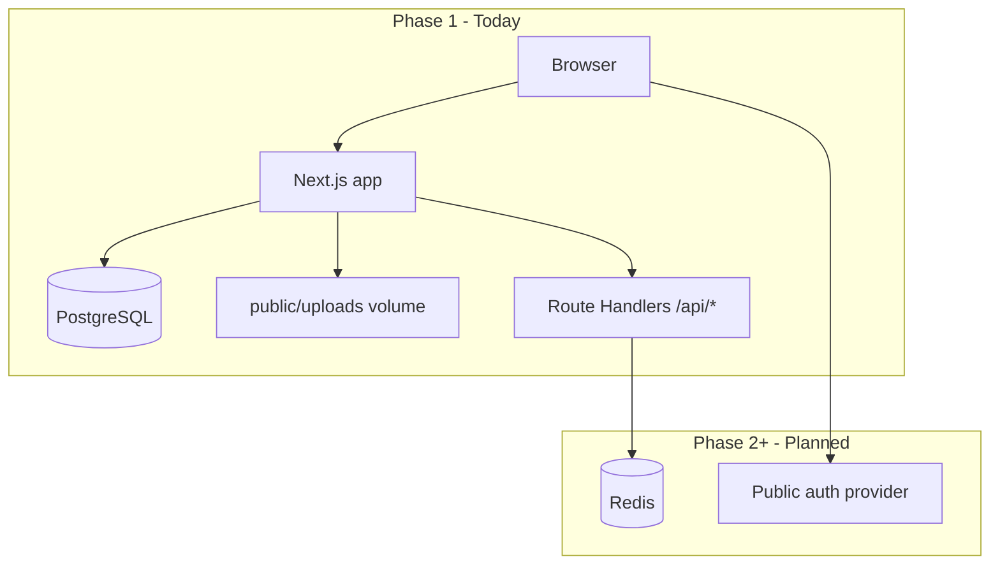

# MBKRU Platform — Architecture & Phased Delivery

This document describes how the codebase is structured for **Phase 1** (live marketing + admin-managed news + lead capture) and how it is intended to **expand into Phase 2 and Phase 3** without rewrites. It complements `PHASE1_SCOPE.md` (what ships in Phase 1) and `ROADMAP_2028_ELECTION.md` (business timeline). **Full Phase 2 & 3 engineering scope, external research links, API build order, and UI charter:** [`docs/PHASES_2_3_IMPLEMENTATION.md`](PHASES_2_3_IMPLEMENTATION.md). **Living backlog of all phase tasks (checkboxes):** [`docs/PHASE_TASKS.md`](PHASE_TASKS.md). **Partner JSON / embeds (draft):** [`docs/PARTNER_API.md`](PARTNER_API.md). **Security & ops:** [`docs/SECURITY_CHECKLIST.md`](SECURITY_CHECKLIST.md) · [`docs/OBSERVABILITY.md`](OBSERVABILITY.md) · [`docs/OPS_RUNBOOK.md`](OPS_RUNBOOK.md).

---

## 1. Current system (Phase 1)

| Layer | Technology | Role in Phase 1 |
|-------|------------|-----------------|
| UI | Next.js 16 App Router, React 19, Tailwind 4 | Public pages, preview pillars, **admin UI** at `/admin` |
| Content | **PostgreSQL + Prisma** | News posts (`Post`), shared **media library** (`Media`), optional featured image per post |
| Auth (admin) | bcrypt + **JWT in httpOnly cookie** (`mbkru_admin`) | Single seeded admin for now; model supports more `Admin` rows later |
| Auth (members, Phase 2+) | bcrypt + **JWT** (`mbkru_member`, `MEMBER_SESSION_SECRET`) | Register/login/logout + `/account`; optional **Redis `jti`** for server-side session end; gated by `NEXT_PUBLIC_PLATFORM_PHASE` ≥ 2 |
| Forms | React Hook Form + Zod → Route Handlers | Contact (optional Resend); newsletter, early access, tracker → **Postgres `LeadCapture`**; optional **Cloudflare Turnstile** when `TURNSTILE_SECRET_KEY` + public site key are set |
| Analytics | `next/script` in `(main)/layout` | Optional **GA4** and/or **Plausible** via `NEXT_PUBLIC_*` env; **not** injected on `/admin` |
| Hosting | Docker (standalone output), optional Coolify on VPS | `mbkru-web` + Postgres; **Redis** in `docker-compose.fullstack.yml` for Phase 2 sessions / rate limits |

Phase 1 **intentionally excludes** public user accounts, complaint workflows, MP datasets, and scorecard engines. Those belong to **Phase 2+** and are gated in code via **platform phase** configuration (see §5).

---

## 2. High-level diagram

**Principle:** **Editorial news and reusable assets** live in **Postgres** (and on-disk uploads referenced by `Media`). **Transactional and user data** (complaints, audit logs, rate limits) also land in **PostgreSQL / Redis** as Phase 2 grows — keep one clear source of truth per domain.

---

## 3. Repository layout (conventions)

| Path | Purpose |
|------|---------|
| `src/app/(main)/` | Public marketing routes; route groups keep layouts consistent |
| `src/proxy.ts` | Next.js 16 **proxy** (edge): JWT gates for **`/admin/*`** (except login) and **`/account/*`**, plus `X-Robots-Tag: noindex, nofollow` on those paths (complements `robots.ts`) |
| `src/app/admin/` | Authenticated admin: login, posts CRUD, media library |
| `src/app/api/` | Server-only HTTP API; admin login/logout/media upload + public form endpoints |
| `src/components/` | UI; `forms/` holds client forms aligned with API routes |
| `src/config/` | **Platform phase**, feature flags — single source of truth; **`public-platform-nav.ts`** drives header, footer “Our Platform” + “Useful links” + legal row, About/home quick links, **`sitemap.ts`** static paths, and **`/account`** explore links from the same gates |
| `src/lib/` | Shared utilities; **`env.server.ts`** is server-only |
| `src/lib/admin/` | JWT session helpers, `requireSession` for server actions |
| `prisma/`, **`prisma.config.ts`** | Schema, migrations, **seed** (first admin from env); seed command is configured in **`prisma.config.ts`** (replaces deprecated `package.json#prisma`) |
| `docker-compose*.yml`, `Dockerfile` | Container images; **build args** bake `NEXT_PUBLIC_*` at build time |

**API route naming:** Keep one concern per route (`/api/contact`, `/api/newsletter`, …). Phase 2 can add `/api/v2/...` or versioned packages if the surface grows large.

---

## 4. Phase boundaries (product vs code)

| Capability | Phase 1 | Phase 2 | Phase 3 |
|------------|---------|---------|---------|
| Public site + admin CMS | Yes | Yes | Yes |
| Lead capture (forms) | Yes (Postgres + optional ESP) | Hardened + stored | Yes |
| User registration / login | No | Yes (MVP) | Yes |
| MBKRU Voice (complaints, geo) | Preview only | **Pilot:** `POST /api/reports`, track API, `/citizens-voice/submit`, admin queue; attachments TBD | Yes |
| Parliament / minister datasets | Preview only | Pipeline | Scorecards |
| People’s Report Card (public pages + partner JSON) | No | **Yes** (published cycles) | Yes |
| Pre-election flagship extras | No | Partial | **Reserved** (`accountabilityScorecards` Phase 3) |

Code should **not** implement Phase 2 features behind hidden flags in production Phase 1 builds; use `NEXT_PUBLIC_PLATFORM_PHASE` (and server `PLATFORM_PHASE` if needed) so builds and behavior stay explicit.

---

## 5. Platform phase & feature flags

- **`NEXT_PUBLIC_PLATFORM_PHASE`**: `1` \| `2` \| `3` — baked at **build time** for client-visible behavior.
- **`PLATFORM_PHASE`** (optional, server): override for APIs if you ever need server-only phase without exposing to the client.

Implementation: `src/config/platform.ts`. Use these flags to guard new routes, navigation, and API behavior when you start Phase 2.

---

## 6. Data strategy

| Data type | Phase 1 | Later phases |
|-----------|---------|--------------|
| News posts, media metadata | PostgreSQL (`Post`, `Media`) | Same; richer workflows |
| Regions / members / citizen reports | — | `Region`, `Member`, `CitizenReport`, attachments (Phase 2+) |
| MPs, tracked commitments, report cards | — | `ParliamentMember`, `CampaignPromise`, `ReportCardCycle`, `ScorecardEntry` (Phase 2–3) |
| Uploaded files | Disk (`public/uploads`) + volume in Docker | Optional S3-compatible object storage |
| Form submissions | Logs / external ESP | **`LeadCapture`** + **`ContactSubmission`** (contact form full text); ESP optional; Redis for rate limiting |
| Public users, complaints | N/A | PostgreSQL (+ optional Auth.js / Clerk / etc.) |
| Pillar pages (legal desk, town halls) | Preview / hidden | **`/legal-empowerment`**, **`/town-halls`** when Phase ≥ 2 (`platformFeatures`); 404 on Phase 1 builds |
| Sessions / cache | Admin JWT cookie | Redis for sessions / queues |

**Postgres + Redis** in `docker-compose.fullstack.yml` let **Coolify/VPS** run the full stack; the app uses Postgres today for news; Redis is ready for rate limits and jobs.

### 6.1 Public accountability JSON (Phase ≥ 2 / 3)

Read-only routes for partners and embeds (gated by `platformFeatures` in `src/config/platform.ts`). All use **Redis-backed rate limits** when `REDIS_URL` is set, **`unstable_cache`** with tags in **`src/lib/server/accountability-cache.ts`**, and aligned **`Cache-Control`** on successful responses — see **`docs/OPS_RUNBOOK.md`**.

| HTTP | When enabled |
|------|----------------|
| `GET /api/mps` | Phase ≥ 2 (`parliamentTrackerData`) — active `ParliamentMember` rows + `promiseCount` |
| `GET /api/promises` | Phase ≥ 2 — optional `?memberSlug=` filter |
| `GET /api/report-card/[year]` | Phase ≥ 2 (`publicReportCard`) — published cycle only; **404** uses `private, no-store` |

Admin **CSV import** and **catalogue** mutations call **`revalidateTag`** so JSON and HTML stay in sync without waiting for the TTL.

### 6.2 MBKRU Voice UI telemetry (`mbkru_voice_analytics_events`)

Allow-listed client events post to **`POST /api/analytics/mbkru-voice-event`** (optional **`MBKRU_VOICE_EVENT_TOKEN`** / header **`x-mbkru-event-token`**). Rows land in PostgreSQL table **`mbkru_voice_analytics_events`**, modeled in Prisma as **`MbkruVoiceAnalyticsEvent`** (`prisma/schema.prisma`). Migration **`20260424163000_mbkru_voice_analytics_events`** creates the table and indexes idempotently.

**Bootstrap:** `src/lib/server/mbkru-voice-analytics.ts` still runs **`CREATE TABLE IF NOT EXISTS`** on first write so older deployments that have not yet applied the migration keep working; new environments should rely on **`prisma migrate deploy`**. Inserts use **`prisma.mbkruVoiceAnalyticsEvent.create`**; aggregate admin queries continue to use **raw SQL** for `COUNT`/`GROUP BY` windows.

Event names, human-readable definitions, and request bodies are governed by **`src/lib/mbkru-voice-analytics-taxonomy.ts`** and validated with **Zod** in **`src/lib/validation/mbkru-voice.ts`** (same data drives **`/admin/analytics/mbkru-voice`**). Client beacons use **`trackUiEvent`** in **`src/lib/client/analytics-events.ts`**, typed to **`MbkruVoiceAnalyticsEventName`** so new UI events must extend the taxonomy before shipping.

---

## 7. Environment variables

See `.env.example`. Critical rules:

1. **`NEXT_PUBLIC_*`** — inlined at **`next build`**. Docker must pass **build args** (see Dockerfile), not only runtime `environment:` in Compose.
2. **Secrets** (API keys, `DATABASE_URL` passwords, `ADMIN_SESSION_SECRET`) — never `NEXT_PUBLIC_*`; only server / Coolify secrets.

---

## 8. Operations

- **Health check:** `GET /api/health` — uptime for proxies (Coolify, Traefik). Returns **phase**, Postgres/Redis probe status, and **`accountability`** booleans (`parliamentJson`, `reportCardJson`) so monitors know which public JSON routes the build enables. **503** when Postgres is configured but unreachable; Redis probe failure yields **degraded** with HTTP 200.
- **Sitemap / SEO:** `src/app/sitemap.ts`, `robots.ts` — use `NEXT_PUBLIC_SITE_URL` everywhere the canonical URL matters.
- **Migrations & seed:** `docker-entrypoint.sh` runs `prisma migrate deploy` then `prisma db seed` when `DATABASE_URL` is set (skip seed with `SKIP_DB_SEED=1`). If either step fails at deploy time, the app still starts; an admin can retry from **`/admin/settings`** (API: `POST /api/admin/database-maintenance`).

---

## 9. Phase 2 / 3 extension checklist (engineering)

When extending Phase 2, prefer this order:

1. **Rate limiting** (Redis) on public `POST` routes.
2. **Public auth** boundary (separate from admin JWT) + session store.
3. Replace form **TODOs** in `/api/*` with persisted records + provider calls.
4. Add **background jobs** (later: BullMQ / Inngest) — Redis as broker.
5. Optional: move uploads to **object storage**; keep `Media` URLs pointing at CDN.

When starting Phase 3 analytics-heavy features, add **read replicas** or **cached aggregates** as needed.

---

## 10. Technical debt & known gaps (honest)

- **Resources / About / Partners** may stay **static or code-edited** (`site-content` + page TSX) until you wire more CMS-like flows.
- **Contact / newsletter / signup** routes log or stub — integrate Resend, Mailchimp, etc., for production.
- **`metadataBase`** in root layout should stay aligned with `NEXT_PUBLIC_SITE_URL` for correct OG URLs on self-hosted domains.

This file should be updated when major boundaries move (e.g. Phase 2 launch date, new services).
