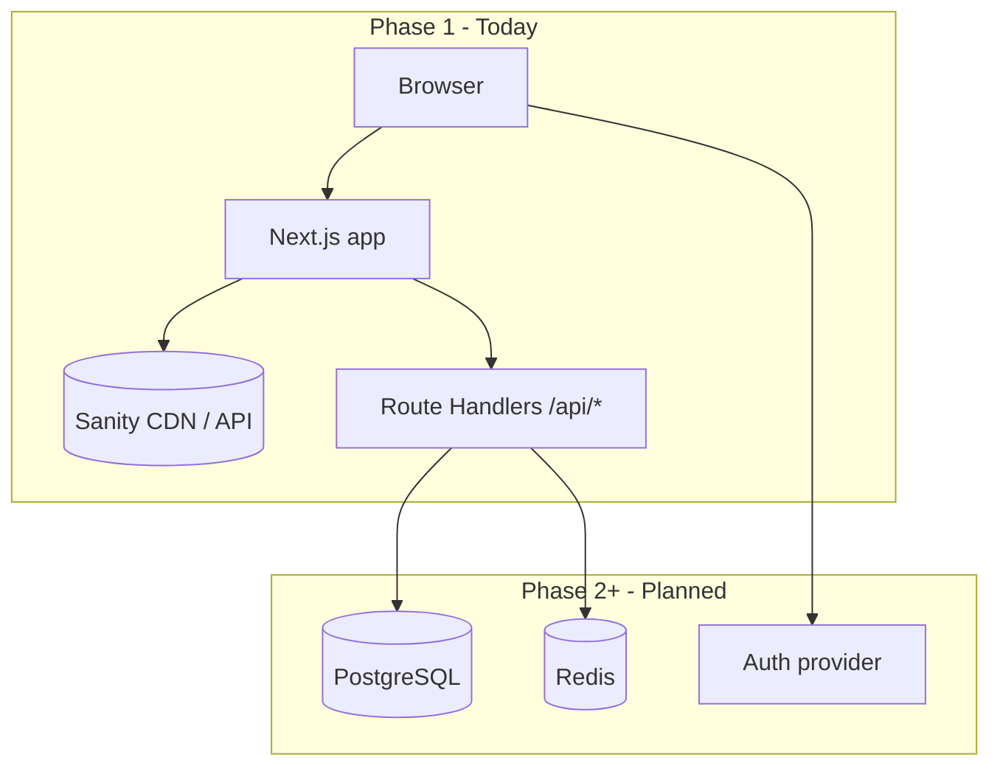

# MBKRU Platform — Architecture & Phased Delivery

This document describes how the codebase is structured for **Phase 1** (live marketing + CMS + lead capture) and how it is intended to **expand into Phase 2 and Phase 3** without rewrites. It complements `PHASE1_SCOPE.md` (what ships in Phase 1) and `ROADMAP_2028_ELECTION.md` (business timeline).

---

## 1. Current system (Phase 1)

| Layer | Technology | Role in Phase 1 |
|-------|------------|-----------------|
| UI | Next.js 16 App Router, React 19, Tailwind 4 | Public pages, preview pillars, Sanity Studio at `/studio` |
| Content | Sanity (headless CMS) | News, resources, team, partners; portable content API |
| Forms | React Hook Form + Zod → Route Handlers | Contact, newsletter, early access, tracker signup — **server handlers are stubs / logging** until integrations are wired |
| Hosting | Docker (standalone output), optional Coolify on VPS | Single `mbkru-web` container; optional Postgres + Redis compose for future phases |

Phase 1 **intentionally excludes** authenticated users, complaint workflows, MP datasets, and scorecard engines. Those belong to **Phase 2+** and are gated in code via **platform phase** configuration (see §5).

---

## 2. High-level diagram

**Principle:** Content stays in **Sanity** where it is editorial. **Transactional and user data** (accounts, complaints, audit logs, rate limits) belong in **PostgreSQL / Redis** when Phase 2 enables them — not duplicated in Sanity.

---

## 3. Repository layout (conventions)

| Path | Purpose |
|------|---------|
| `src/app/(main)/` | Public marketing routes; route groups keep layouts consistent |
| `src/app/api/` | Server-only HTTP API; **extension point** for email, DB, queues |
| `src/app/studio/` | Embedded Sanity Studio |
| `src/components/` | UI; `forms/` holds client forms aligned with API routes |
| `src/config/` | **Platform phase**, feature flags — single source of truth |
| `src/lib/` | Shared utilities; **`env.server.ts`** is server-only |
| `src/lib/server/` | Server-only helpers (health checks, future Prisma/Redis) |
| `sanity/schemas/` | CMS content models — evolve with editorial needs |
| `lib/sanity.ts` | Sanity client (root `lib/`); prefer `@/lib/...` under `src/` for new code |
| `docker-compose*.yml`, `Dockerfile` | Container images; **build args** bake `NEXT_PUBLIC_*` at build time |

**API route naming:** Keep one concern per route (`/api/contact`, `/api/newsletter`, …). Phase 2 can add `/api/v2/...` or versioned packages if the surface grows large.

---

## 4. Phase boundaries (product vs code)

| Capability | Phase 1 | Phase 2 | Phase 3 |
|------------|---------|---------|---------|
| Public site + CMS | Yes | Yes | Yes |
| Lead capture (forms) | Yes (stubs / integrations TBD) | Hardened + stored | Yes |
| User registration / login | No | Yes (MVP) | Yes |
| MBKRU Voice (complaints, geo) | Preview only | Pilot → full | Yes |
| Parliament / minister datasets | Preview only | Pipeline | Scorecards |
| People’s Report Card / Accountability Scorecards | No | Data collection | **Flagship** |

Code should **not** implement Phase 2 features behind hidden flags in production Phase 1 builds; use `NEXT_PUBLIC_PLATFORM_PHASE` (and server `PLATFORM_PHASE` if needed) so builds and behavior stay explicit.

---

## 5. Platform phase & feature flags

- **`NEXT_PUBLIC_PLATFORM_PHASE`**: `1` \| `2` \| `3` — baked at **build time** for client-visible behavior.
- **`PLATFORM_PHASE`** (optional, server): override for APIs if you ever need server-only phase without exposing to the client.

Implementation: `src/config/platform.ts`. Use these flags to guard new routes, navigation, and API behavior when you start Phase 2.

---

## 6. Data strategy

| Data type | Phase 1 | Later phases |
|-----------|---------|--------------|
| Articles, pages, assets | Sanity | Same |
| Form submissions | Logs / external ESP | DB + ESP; Redis for rate limiting |
| Users, roles, complaints | N/A | PostgreSQL (+ optional Auth.js / Clerk / etc.) |
| Sessions / cache | N/A | Redis |

**Postgres + Redis** in `docker-compose.fullstack.yml` exist so **Coolify/VPS** can run the full stack; application code connects when `DATABASE_URL` / `REDIS_URL` are set and Phase 2 features are implemented.

---

## 7. Environment variables

See `.env.example`. Critical rules:

1. **`NEXT_PUBLIC_*`** — inlined at **`next build`**. Docker must pass **build args** (see Dockerfile), not only runtime `environment:` in Compose.
2. **Secrets** (API keys, `DATABASE_URL` passwords) — never `NEXT_PUBLIC_*`; only server / Coolify secrets.

---

## 8. Operations

- **Health check:** `GET /api/health` — uptime for proxies (Coolify, Traefik). Phase 1 returns phase and optional dependency status; extend for DB/Redis checks in Phase 2.
- **Sitemap / SEO:** `src/app/sitemap.ts`, `robots.ts` — use `NEXT_PUBLIC_SITE_URL` everywhere the canonical URL matters.

---

## 9. Phase 2 / 3 extension checklist (engineering)

When starting Phase 2, prefer this order:

1. Add **Prisma** (or similar) + migrations; point `DATABASE_URL` at Postgres.
2. Implement **rate limiting** (Redis) on public `POST` routes.
3. Introduce **auth** boundary (middleware + session store).
4. Replace form **TODOs** in `/api/*` with persisted records + provider calls.
5. Add **background jobs** (later: BullMQ / Inngest) for heavy work — Redis as broker.

When starting Phase 3 analytics-heavy features, add **read replicas** or **cached aggregates** as needed; keep Sanity for editorial, Postgres for operational data.

---

## 10. Technical debt & known gaps (honest)

- Several **news/resources** views still use **placeholder data**; wire `lib/sanity.ts` / `next-sanity` queries when CMS content is ready.
- **Contact / newsletter / signup** routes log or stub — integrate Resend, Mailchimp, etc., for production.
- **metadataBase** in root layout should stay aligned with `NEXT_PUBLIC_SITE_URL` for correct OG URLs on self-hosted domains.

This file should be updated when major boundaries move (e.g. Phase 2 launch date, new services).
