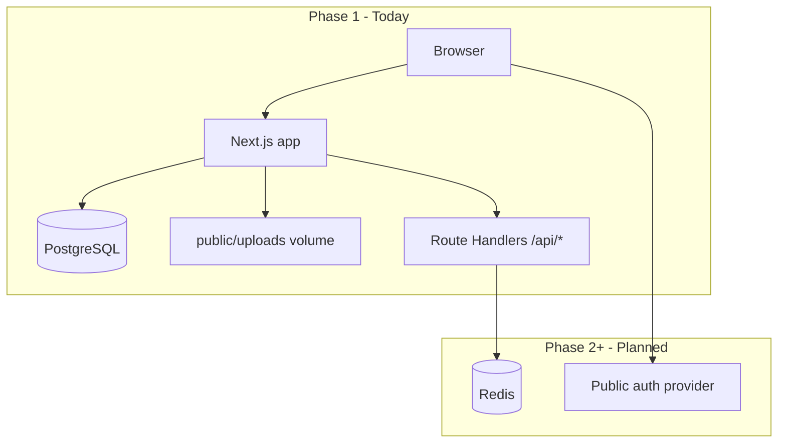

# MBKRU Platform — Architecture & Phased Delivery

This document describes how the codebase is structured for **Phase 1** (live marketing + admin-managed news + lead capture) and how it is intended to **expand into Phase 2 and Phase 3** without rewrites. It complements `PHASE1_SCOPE.md` (what ships in Phase 1) and `ROADMAP_2028_ELECTION.md` (business timeline).

---

## 1. Current system (Phase 1)

| Layer | Technology | Role in Phase 1 |
|-------|------------|-----------------|
| UI | Next.js 16 App Router, React 19, Tailwind 4 | Public pages, preview pillars, **admin UI** at `/admin` |
| Content | **PostgreSQL + Prisma** | News posts (`Post`), shared **media library** (`Media`), optional featured image per post |
| Auth (admin only) | bcrypt + **JWT in httpOnly cookie** | Single seeded admin for now; model supports more `Admin` rows later |
| Forms | React Hook Form + Zod → Route Handlers | Contact, newsletter, early access, tracker signup — **server handlers are stubs / logging** until integrations are wired |
| Hosting | Docker (standalone output), optional Coolify on VPS | `mbkru-web` + Postgres; optional Redis in full stack compose |

Phase 1 **intentionally excludes** public user accounts, complaint workflows, MP datasets, and scorecard engines. Those belong to **Phase 2+** and are gated in code via **platform phase** configuration (see §5).

---

## 2. High-level diagram

**Principle:** **Editorial news and reusable assets** live in **Postgres** (and on-disk uploads referenced by `Media`). **Transactional and user data** (complaints, audit logs, rate limits) also land in **PostgreSQL / Redis** as Phase 2 grows — keep one clear source of truth per domain.

---

## 3. Repository layout (conventions)

| Path | Purpose |
|------|---------|
| `src/app/(main)/` | Public marketing routes; route groups keep layouts consistent |
| `src/app/admin/` | Authenticated admin: login, posts CRUD, media library |
| `src/app/api/` | Server-only HTTP API; admin login/logout/media upload + public form endpoints |
| `src/components/` | UI; `forms/` holds client forms aligned with API routes |
| `src/config/` | **Platform phase**, feature flags — single source of truth |
| `src/lib/` | Shared utilities; **`env.server.ts`** is server-only |
| `src/lib/admin/` | JWT session helpers, `requireSession` for server actions |
| `prisma/` | Schema, migrations, **seed** (first admin from env) |
| `docker-compose*.yml`, `Dockerfile` | Container images; **build args** bake `NEXT_PUBLIC_*` at build time |

**API route naming:** Keep one concern per route (`/api/contact`, `/api/newsletter`, …). Phase 2 can add `/api/v2/...` or versioned packages if the surface grows large.

---

## 4. Phase boundaries (product vs code)

| Capability | Phase 1 | Phase 2 | Phase 3 |
|------------|---------|---------|---------|
| Public site + admin CMS | Yes | Yes | Yes |
| Lead capture (forms) | Yes (stubs / integrations TBD) | Hardened + stored | Yes |
| User registration / login | No | Yes (MVP) | Yes |
| MBKRU Voice (complaints, geo) | Preview only | Pilot → full | Yes |
| Parliament / minister datasets | Preview only | Pipeline | Scorecards |
| People’s Report Card / Accountability Scorecards | No | Data collection | **Flagship** |

Code should **not** implement Phase 2 features behind hidden flags in production Phase 1 builds; use `NEXT_PUBLIC_PLATFORM_PHASE` (and server `PLATFORM_PHASE` if needed) so builds and behavior stay explicit.

---

## 5. Platform phase & feature flags

- **`NEXT_PUBLIC_PLATFORM_PHASE`**: `1` \| `2` \| `3` — baked at **build time** for client-visible behavior.
- **`PLATFORM_PHASE`** (optional, server): override for APIs if you ever need server-only phase without exposing to the client.

Implementation: `src/config/platform.ts`. Use these flags to guard new routes, navigation, and API behavior when you start Phase 2.

---

## 6. Data strategy

| Data type | Phase 1 | Later phases |
|-----------|---------|--------------|
| News posts, media metadata | PostgreSQL (`Post`, `Media`) | Same; richer workflows |
| Uploaded files | Disk (`public/uploads`) + volume in Docker | Optional S3-compatible object storage |
| Form submissions | Logs / external ESP | DB + ESP; Redis for rate limiting |
| Public users, complaints | N/A | PostgreSQL (+ optional Auth.js / Clerk / etc.) |
| Sessions / cache | Admin JWT cookie | Redis for sessions / queues |

**Postgres + Redis** in `docker-compose.fullstack.yml` let **Coolify/VPS** run the full stack; the app uses Postgres today for news; Redis is ready for rate limits and jobs.

---

## 7. Environment variables

See `.env.example`. Critical rules:

1. **`NEXT_PUBLIC_*`** — inlined at **`next build`**. Docker must pass **build args** (see Dockerfile), not only runtime `environment:` in Compose.
2. **Secrets** (API keys, `DATABASE_URL` passwords, `ADMIN_SESSION_SECRET`) — never `NEXT_PUBLIC_*`; only server / Coolify secrets.

---

## 8. Operations

- **Health check:** `GET /api/health` — uptime for proxies (Coolify, Traefik). Phase 1 returns phase and optional dependency status; extend for DB/Redis checks in Phase 2.
- **Sitemap / SEO:** `src/app/sitemap.ts`, `robots.ts` — use `NEXT_PUBLIC_SITE_URL` everywhere the canonical URL matters.
- **Migrations:** `docker-entrypoint.sh` runs `prisma migrate deploy` when `DATABASE_URL` is set. **Seed** (`prisma db seed`) is run manually after first deploy to create the admin.

---

## 9. Phase 2 / 3 extension checklist (engineering)

When extending Phase 2, prefer this order:

1. **Rate limiting** (Redis) on public `POST` routes.
2. **Public auth** boundary (separate from admin JWT) + session store.
3. Replace form **TODOs** in `/api/*` with persisted records + provider calls.
4. Add **background jobs** (later: BullMQ / Inngest) — Redis as broker.
5. Optional: move uploads to **object storage**; keep `Media` URLs pointing at CDN.

When starting Phase 3 analytics-heavy features, add **read replicas** or **cached aggregates** as needed.

---

## 10. Technical debt & known gaps (honest)

- **Resources / About / Partners** may still use **static or placeholder** copy until you wire more CMS-like flows or keep them as marketing edits in code.
- **Contact / newsletter / signup** routes log or stub — integrate Resend, Mailchimp, etc., for production.
- **`metadataBase`** in root layout should stay aligned with `NEXT_PUBLIC_SITE_URL` for correct OG URLs on self-hosted domains.

This file should be updated when major boundaries move (e.g. Phase 2 launch date, new services).
